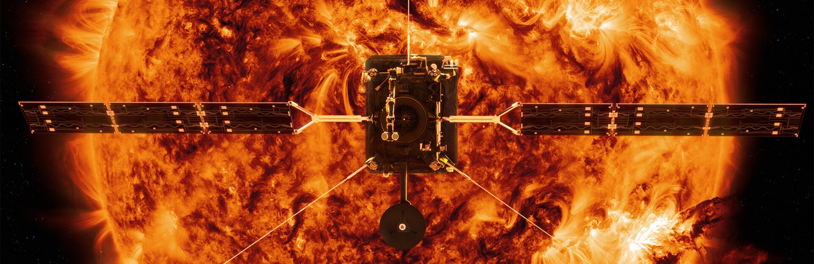
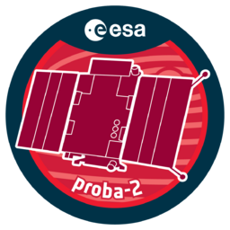

  

## ESA HelioPhysics Archive - Tutorial Notebooks

This repository contains tutorial notebooks demonstrating programmatic access to data from ESA's [Heliophysics Archive](https://hpa.esa.int) (HPA).

You can launch an interactive Jupyter Lab session for all notebooks in this repository using the `launch binder` button above.

### Getting Started

The [Getting Started](getting_started/) directory contains information on the software prerequisites to run the tutorial notebooks as well as introductory notebooks on the usage of [PyVO](getting_started/01_data_access_with_pyvo.ipynb), [astroquery](getting_started/02_data_access_with_astroquery.ipynb), and [sunpy](getting_started/03_data_access_with_sunpy.ipynb).

If you are already familiar with these topics, you can move straight on to the mission tutorials.

### Mission Tutorials

||
|:-------------------------:|
| |
|[Proba-2](proba2/)| 
